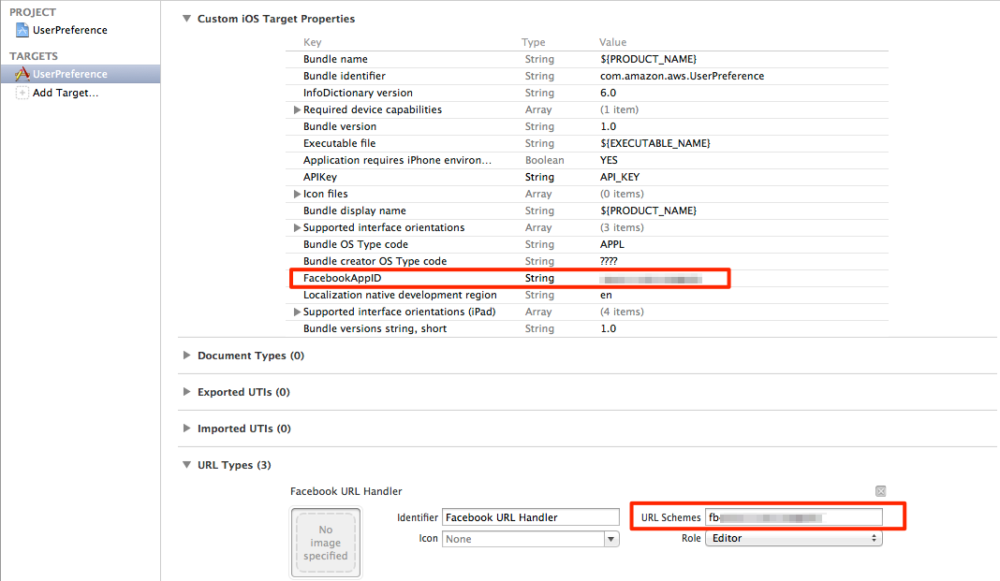

## Running the MobilePhotoShare iOS App

The following instructions detail how to get the iOS App sample running for **MobilePhotoShare**.  It is assumed that you have done following:
    
   * Created your [Facebook Application](Facebook Setup.md).
   * Setup your web identitiy federation role.
   * The **MobilePhotoShare** server is running.
   * Created the necessary AWS resources for Amazon DynamoDB and Amazon S3.

Running the iOS App:

1.  Open the **MobilePhotoShare/MobilePhotoShare.xcodeproj** project file in Xcode.
1.  1.  In the Project Navigator, Right-Click on the **Frameworks** group.
    1.  In the Menu select Add Files to **MobilePhotoShare**
    1.  Navigate to the location where you downloaded and expanded the AWS SDK for iOS.
    1.  Select the following frameworks and click Add:
        * AWSRuntime.framework
        * AWSDynamoDB.framework
        * AWSSecurityTokenService.framework
        * AWSS3.framework
        * AWSSNS.framework
        * ThirdParty/FacebookSDK.framework
1.  Update the MobilePhotoShare sample with the necessary configuration.  
	1. Open the **Constants.h** file.
    1. Enter the name of *Amazon S3* Bucket you created for constant **BUCKET_NAME**.
    1. Modify the **SERVER_ENDPOINT** with the URL where your **MobilePhotoShare** server is running (ex: http://127.0.0.1/).
    1. Update the **FB_ROLE_ARN** with the *Facebook* **web identity federation role** you created.
1.  Switch to the project view and select the **MobilePhotoShare** target
1.  Enter just your Facebook App ID under **Custom iOS Target Properties**
1.  Update the Facebook URL Handler `URL Schemes` as shown the following screenshot, using the form `fb#########`
**NOTE: the preceding 'fb' before the numeric App ID is REQUIRED.**

    

### Run the sample

1.  Run the sample on your simulator or device.
2.  You may want to install the Facebook application on your device to see the native login experience.
