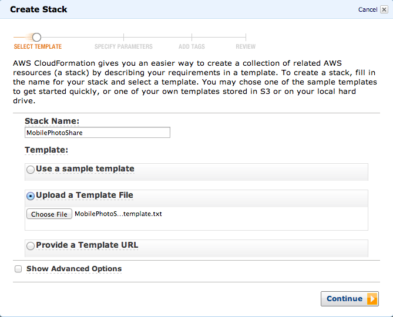
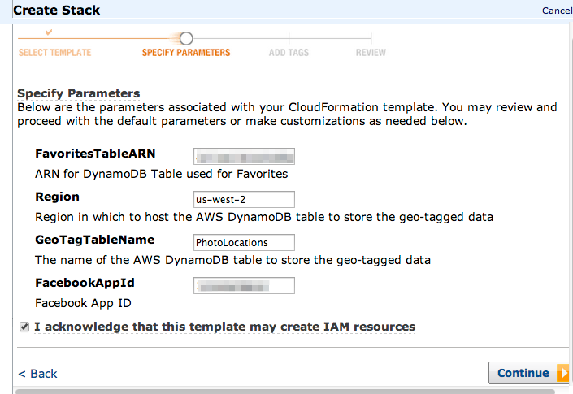
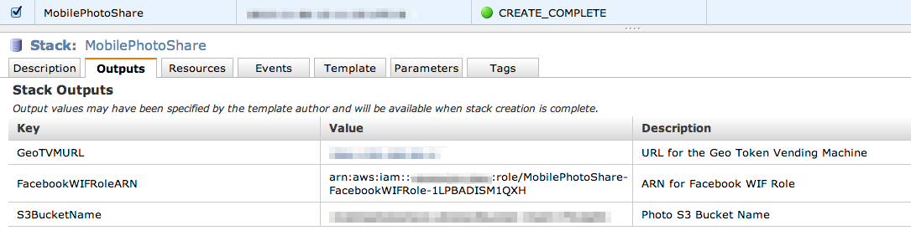

## Setting up your AWS resources using Cloud Formation

These instructions detail how to setup all the necessary AWS resources using a Cloud Formation template.

1.  Visit the [AWS Management Console](https://console.aws.amazon.com/cloudformation/home?region=us-west-2).

### Click on Create Stack
* Enter a **Stack Name** (ex: MobilePhotoShare)
* Click **Upload a Template File** then **Choose File**
* Browse to and select the [MobilePhotoShare-template.txt](MobilePhotoShare-template.txt) file
* Click **Continue**   

## Specify the Parameters for the stack
*  Provide the **FavoritesTableARN**, this is the ARN for the Amazon DynamoDB table you created earlier.
*  Provide the **FacebookAppId**.
*  Click **Continue**

## Add Tags

* Click **Continue**

## Review

* Click **Continue**
* Click **Close**

## Once the stack is created
* Click the **Output Tab**
* The output keys **GeoTVMURL**, **FacebookWIFRoleARN** and **S3BucketName** will be necessary to get the app running.

