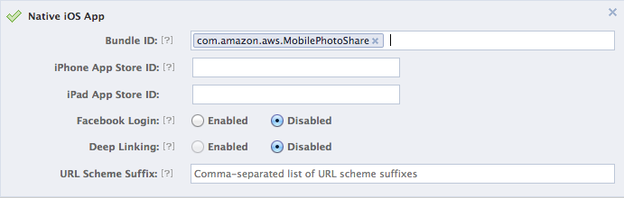

## Creating a Facebook Application

These instructions detail how to create a Facebook application that will enable web identity federation as part of the MobilePhotoShare sample app.

1.  Sign up for the Facebook developer program at [developers.facebook.com](https://developers.facebook.com/)
2.  Visit the guide [Getting Started with the Facebook SDK for iOS](https://developers.facebook.com/docs/getting-started/facebook-sdk-for-ios/) and follow the instructions to **Create a Facebook App**. Make note of your `App ID`. You'll use it in configuring the sample. The other steps in this guide will be useful with your future Facebook Apps, but are not necessary for this sample.
    
3.  You may enter any reasonable values under **Basic Info**. These values do not affect the integration between the sample and Facebook.
4.  Under **Select how your app integrates with Facebook** select **Native iOS App**.
    
5.  Enter the following as your **Bundle ID**: `com.amazon.aws.MobilePhotoShare`.
    
